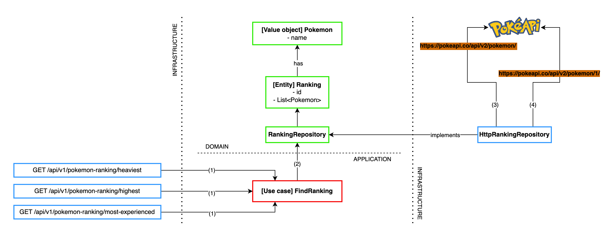

# 🦆 Pokémon Ranking API 🔝


### Solution details



#### Decisions made

I think that most relevant thing is having used a hexagonal architecture to shape the project. I know there are many
other ways to apply this kind of architecture so this is only the way I see it. It helped not only to define an
architecture over a service but to also define testing boundaries that more than to be restrictive are indicative.

Also, when I have to implement a solution I try to first consider the problem and for me that means building a test that
apart from helping to validate the solution also makes me think about other factors that in the first instance I could
have missed.

Clarified that, I first decided what would be domain and what would be infrastructure on this problem, which was to
retrieve Pokémon rankings based on different criteria. I put the action of retrieve and limit the ranking in domain as
it is something that could make sense to vary based on functional requirements. Construction of the ranking though has
been considered infrastructure as it could come directly from the PokéAPI (not really) or have some preprocessing or
even caching without affecting the domain. I planned my steps in this way, and it could be seen
in [how I integrated my solutions into the main branch](https://github.com/erickgualpa/pokemon-ranking-api/pulls?q=),
first trying to resolve the functional requirements and then giving a workaround to the performance issue on the PokéAPI
requests.

#### Solution improvements

Infrastructure could be refactored and optimized. Domain is sufficiently well-defined to allow the addition of new
rankings also giving freedom on the limit factor but infrastructure is tightly coupled to the PokéAPI. Considering that,
the solution provided is just a first first approach to make it "production ready" but to be actually ready alternatives
like caching should be considered. Even when caching could be a nightmare most of the time, the nature of the problem
faced seems to be requesting it as the dependency with the PokéAPI is requiring HTTP requests each time a ranking is
built.

In any case, this problem seems to be addressed already by the PokéAPI as the data offered by it are details from
beings (fantastic beings in this case, but it could be compared to animals) that are not updated frequently. Caching a
preprocessed view from the details required to calculate a ranking could help to reduce possible dependency issues such
as timeouts or connection failures. The caching could be performed on application startup or on the first request made
(depending on what affects less to the service availability). Once something like that is configured, rankings would be
built based on data now owned by the service, so even a two-level-cache could be implemented as well (if needed),
holding the most popular rankings built from the main cache.

On this scenario `pokemon-ranking-api` would be just a supplier of rankings based on in-memory preprocessed data.

#### Code improvements

- Clean up e2e tests.
- Clean up `HttpRankingRepository`.
- Configure PokéAPI client bean from `PokemonRankingApiConfiguration` instead of building it in `HttpRankingRepository`.
- Define and throw specific exceptions on sad paths.
- Add integration tests covering sad paths from `HttpRankingRepository`.
- Address non-deterministic rankings when there are several Pokémons with same criteria value.

#### Time spent on solution ⏳

- ~1h ➡️ Lecture of the problem and sketch of the diagram
- ~4h ➡️ Code implementation
- ~1h ➡️ Performance issue
- ~1h ➡️ Decisions made and improvements writing

#### Clarification

Some parts of this repository have been reused from
[one of my repositories](https://github.com/erickgualpa/hotel-management-service) (mainly a simple CI build and docker
container deployment process)

---
🧪 Run tests
<br>

```shell script
./mvnw clean verify
```

🚀 Build and deploy service as container! 🐳
<br>

```shell script
./build_and_deploy.sh
```

💤 Clear service containers

```shell script
docker compose down --rmi local
``` 

🔹 Use of this service is specified through [SpringDoc OpenAPI Swagger UI](http://localhost:8080/swagger-ui/index.html).

📣 This project has been structured following a Hexagonal Architecture

[//]: # (Directory tree below was generated using 'tree -d -I target' command)

```
.
└── src
    ├── main
    │   ├── java
    │   │   └── org
    │   │       └── egualpam
    │   │           └── services
    │   │               └── pokemon
    │   │                   └── pokemonrankingapi
    │   │                       ├── application
    │   │                       ├── domain
    │   │                       └── infrastructure
    │   │                           ├── configuration
    │   │                           ├── controllers
    │   │                           └── repositories
    │   └── resources
    └── test
        ├── java
        │   └── org
        │       └── egualpam
        │           └── services
        │               └── pokemon
        │                   └── pokemonrankingapi
        │                       ├── application
        │                       ├── e2e
        │                       └── infrastructure
        └── resources

```
